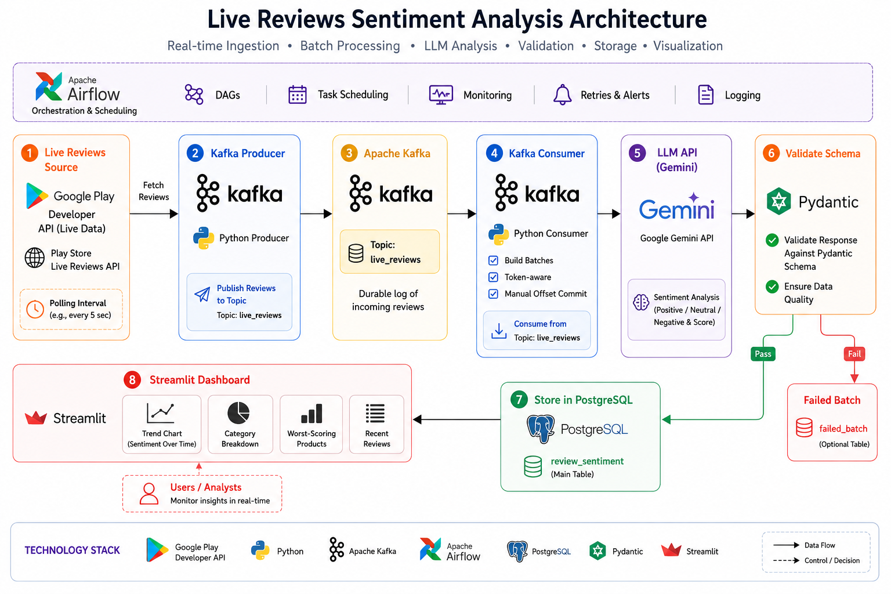
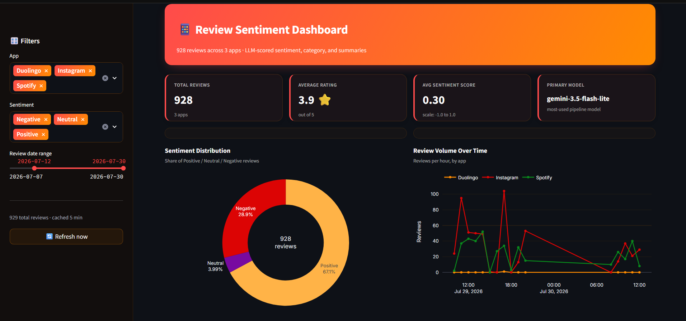
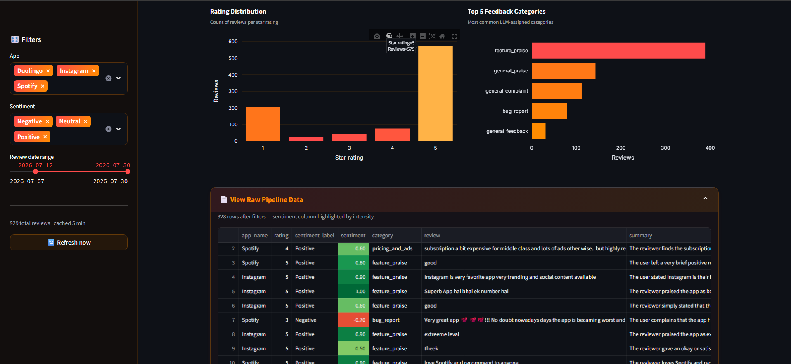
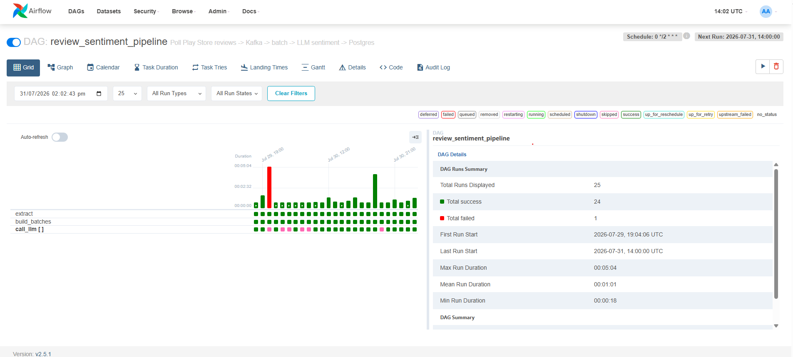

# AI/LLM Review Sentiment Pipeline

A real-time, event-driven data pipeline that ingests live product reviews, streams them through Kafka, batches and sends them to an LLM API for structured sentiment analysis, stores validated results in PostgreSQL, and serves them through a Streamlit dashboard — all orchestrated by Apache Airflow.


---

## 📋 Overview

This pipeline automatically:
1. Polls live 3 apps reviews using playstore api and publishes each incoming review to a Kafka topic (`reviews.raw`)
2. **Batches** reviews by token count (not just review count) via a Kafka consumer with manual offset commits
3. Sends each batch to an **LLM API** (Gemini) using structured output mode to extract a sentiment score, category, and one-line summary
4. **Validates** the LLM's output against a pydantic schema — failures are routed to a `failed_batches` table instead of being dropped silently
5. **Upserts** validated results into PostgreSQL, idempotently keyed on `review_id`
6. Serves the results through a **Streamlit dashboard** (trend charts, category breakdown, worst-scoring products)
7. Is fully orchestrated end-to-end by **Apache Airflow** (scheduled polling, dynamic per-batch task mapping, retries, alerting)

This mirrors how companies like Amazon or Shopify sellers monitor product feedback at scale — auto-scoring thousands of reviews for sentiment and urgent complaints instead of reading them by hand. The same pattern applies to support-ticket triage, app-store review monitoring, and social/brand sentiment tracking.

---

## 🏗️ Architecture

**Live Reviews API** → **Producer (Kafka)** → **Consumer (Batching)** → **LLM API** → **Validation Gate** → **PostgreSQL** → **Streamlit Dashboard**

| Stage | Purpose | Format | Storage |
|---|---|---|---|
| **Raw ingestion** | Live reviews published to Kafka as they arrive | JSON | Kafka topic (`reviews.raw`) |
| **Batching** | Token-aware grouping, manual offset commits | JSON batches | In-memory (Kafka consumer) |
| **Sentiment (derived)** | LLM-scored, schema-validated results | Structured rows | PostgreSQL (`review_sentiment`) |
| **Failed validation** | Batches that failed the pydantic schema check | Structured rows | PostgreSQL (`failed_batches`) |


### Architecture Diagram



### Tech Stack

- **Ingestion:** Producer service polling a live reviews API, publishing to **Apache Kafka**
- **Streaming/Queueing:** Kafka + Zookeeper (with **kafka-ui** for visual topic inspection during development)
- **Batching & Processing:** Kafka consumer, token-count-aware batching, manual offset commits (only after a successful downstream write)
- **AI/LLM:** Claude/OpenAI API in structured-output mode for sentiment score, category, and summary
- **Validation:** Pydantic schema checks before any write to PostgreSQL
- **Storage:** PostgreSQL — a **dedicated app database** (`reviews`) fully separate from Airflow's own metadata database
- **Orchestration:** Apache Airflow (CeleryExecutor), dynamic task mapping (one task per batch), retries with `tenacity` backoff, alerting on task failure
- **Dashboard:** Streamlit, reading directly from PostgreSQL (no dependency on Airflow)
- **Containerization:** Docker Compose — separate images for Airflow and the Streamlit dashboard

---
## 📊 Dashboard Output





---
## 🔄 Pipeline Flow (Airflow DAG)

```
extract (poll live API, publish to Kafka)
        │
        ▼
build_batches (Kafka consumer, token-aware batching)
        │
        ▼
call_llm (dynamic task mapping — one task per batch)
        │
        ▼
validate (pydantic schema check)
        │
   ┌────┴────┐
 (pass)     (fail)
   │           │
   ▼           ▼
 upsert    failed_batches
   │
   ▼
review_sentiment (PostgreSQL)
   │
   ▼
Streamlit Dashboard
```

Dynamic task mapping means a failure in one batch retries and logs independently — it doesn't fail the whole DAG run. Kafka offsets are only committed after a batch is fully and successfully handled downstream, so a crash mid-batch never silently drops data.


---

## 🗂️ Database Tables

| Table | Description |
|---|---|
| `raw_reviews` | Immutable raw review text and metadata (`product_id`, `review_text`, `source_fetched_at`) |
| `review_sentiment` | LLM-derived results — score, category, summary, model used, processed timestamp — upserted keyed on `review_id` |
| `failed_batches` | Batches that failed pydantic validation, kept for inspection instead of being dropped |
| `llm_usage` | Token usage per batch, for cost tracking |

---

## ✅ Data Validation & Reliability

Before a batch's results are written to `review_sentiment`, they pass through:

- **Structured output enforcement** — the LLM is called in structured/tool-use mode rather than free-text parsing
- **Schema validation** — every field (score, category, summary) is checked against a pydantic model
- **Idempotent upserts** — keyed on `review_id`, so reruns never create duplicates
- **Retry with backoff** — `tenacity`-based exponential backoff on LLM rate limits
- **Cost tracking** — tokens per batch logged to `llm_usage`
- **Caching** — review text is hashed so already-scored reviews aren't re-sent to the LLM on reruns

If a batch fails validation, the pipeline logs it to `failed_batches` rather than dropping it or crashing the run.

---

## 📁 Repository Structure

```
ai-llm-review-pipeline/
├── README.md
├── docker-compose.yml
├── Dockerfile                       # Airflow image
├── Dockerfile.streamlit             # Dashboard image
├── requirements.txt                 # Airflow container deps
├── requirements-streamlit.txt       # Dashboard deps
├── .env.example                     # LLM_API_KEY, REVIEWS_SOURCE_API_URL, etc.
│
├── dags/
│   └── review_sentiment_pipeline.py # Main Airflow DAG
│
├── sql/
│   └── init.sql                     # raw_reviews, review_sentiment, failed_batches, llm_usage
│
├── src/
│   ├── extract/
│   │   └── producer.py              # Polls live API → publishes to Kafka
│   ├── batching/
│   │   └── build_batches.py         # Kafka consumer → token-aware batches
│   ├── llm/
│   │   ├── client.py                # Claude/OpenAI wrapper, retries via tenacity
│   │   ├── prompts.py                # System prompt + instructions
│   │   └── schema.py                 # Pydantic model: score, category, summary
│   ├── storage/
│   │   ├── models.py                 # SQLAlchemy models
│   │   └── upsert.py                 # Idempotent write logic
│   └── dashboard/
│       └── app.py                    # Streamlit dashboard
│
└── tests/
    ├── test_batching.py
    ├── test_llm_client.py
    └── test_upsert.py
```

---

## ⚙️ Configuration

The pipeline is parameterized via environment variables, so no credentials are hardcoded in application code.

** Create a `.env` file in the project root and add:
**
```
Gemini_API_KEY= "your api key"
AIRFLOW_UID=50000
```

Airflow's own metadata database and the pipeline's application database are **deliberately kept separate** (`airflow-postgres` vs. `app-postgres`) so pipeline data never mixes with Airflow's internal state.

---

## 🚀 Getting Started

```bash
# Clone the repo
git clone https://github.com/Ayan-Ahmad-0/AI-LLM-REVIEW-PIPELINE.git
cd AI-LLM-REVIEW-PIPELINE

# Create a .env file in the project root
# Add your GEMINI_API_KEY and AIRFLOW_UID


# Build and start everything (Airflow, Kafka, both Postgres instances, Streamlit)
docker-compose up --build
```

| Service | URL |
|---|---|
| Airflow UI | http://localhost:8085 |
| Kafka UI | http://localhost:8090 |
| Streamlit Dashboard | http://localhost:8501 |
| App Postgres | `localhost:5433` (db: `reviews`) |

---

## 🚧 Engineering Challenges Solved

- Diagnosed an `airflow-init` crash loop caused by a `SQLAlchemy 2.0.x` pin — Airflow 2.5.1 requires `SQLAlchemy 1.4.x` since 2.0 removed the `executemany_mode='values'` option Airflow's ORM setup still passes. Fixed by pinning `SQLAlchemy==1.4.49` in the Airflow container only, leaving the Streamlit image (a separate, unconstrained container) on `2.0.30`
- Resolved Docker build failures caused by misspelled dependency files (`requirments.txt`) and a missing `Dockerfile.streamlit`
- Kept Airflow's metadata database and the pipeline's application database fully isolated (`airflow-postgres` vs. `app-postgres` on a separate port) to prevent state from mixing
- Designed manual Kafka offset commits so a batch is only marked "consumed" after it's fully written downstream — no silent data loss on a mid-batch crash
- Built dynamic per-batch task mapping in Airflow so one bad batch retries and fails in isolation, without taking down the whole DAG run

---


## 🛠️ Future Improvements

- Add a FastAPI layer in front of PostgreSQL so the dashboard isn't querying the database directly
- Expand to additional live review sources (Best Buy, Reddit)
- Add automated tests for batching, LLM client, and upsert logic
